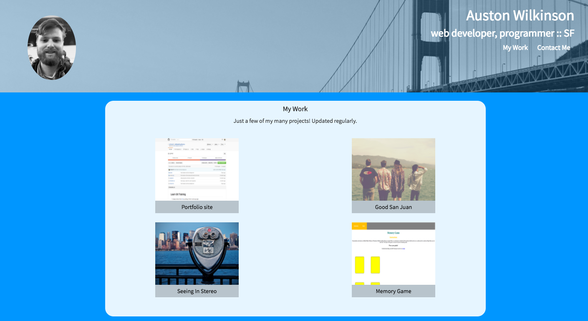

# Auston Wilkinson's Personal Portfolio
My web design portfolio site.

## Goal
This site exists to showcase my abilities as a web developer. I encourage anyone interested in collaborating to reach out via any of the provided contact methods.

## Tools
This site utilizes modern web tools, including HTML5, CSS3, ES6, jQuery, and Bootstrap. It has responsive design via Bootstrap's grid system. Data is imported to the "My Work" section using JSON and jQuery. There is smooth scrolling between sections using an open source JavaScript file from Startbootstrap.com.

## View the site

[Click here to view the site](wilkdasilk.github.io)
